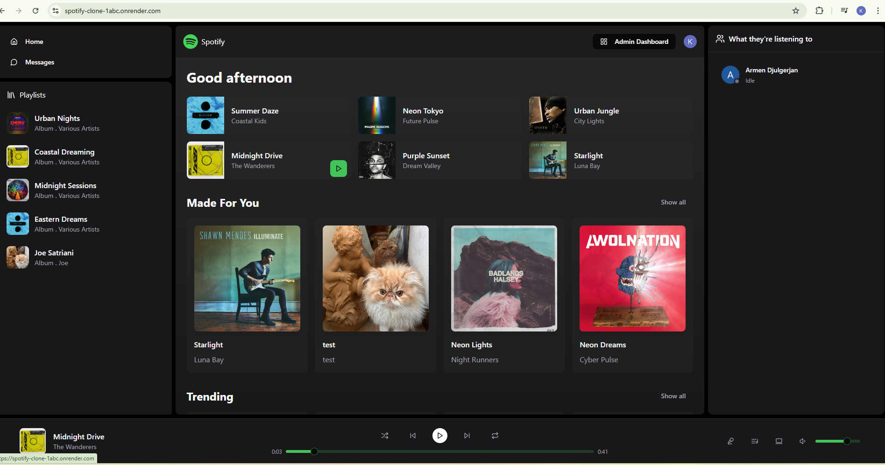
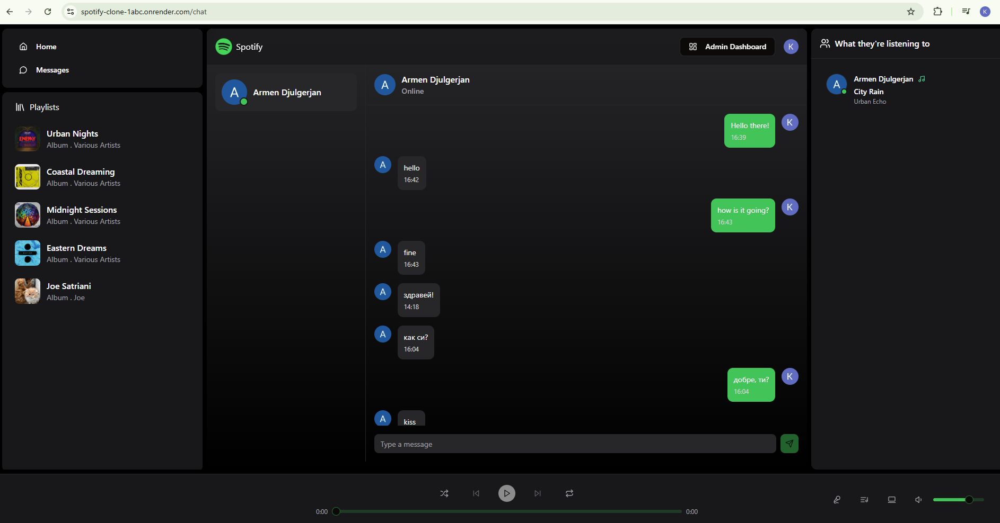
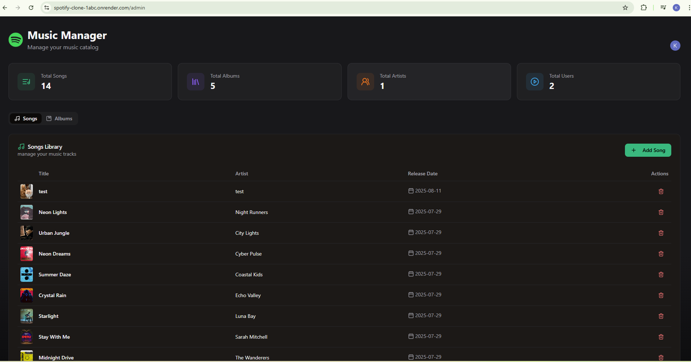
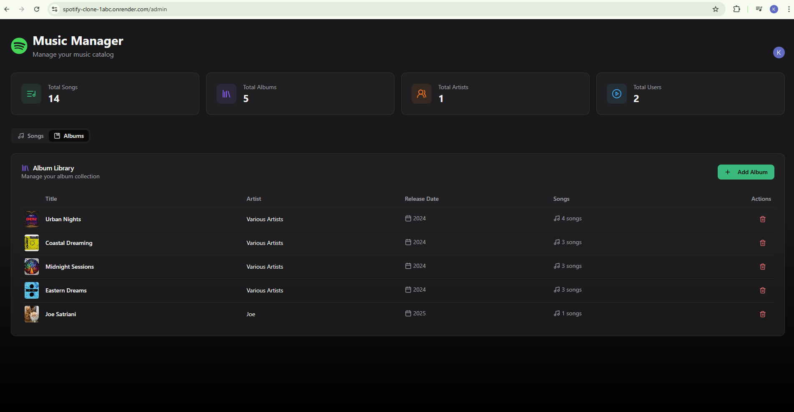
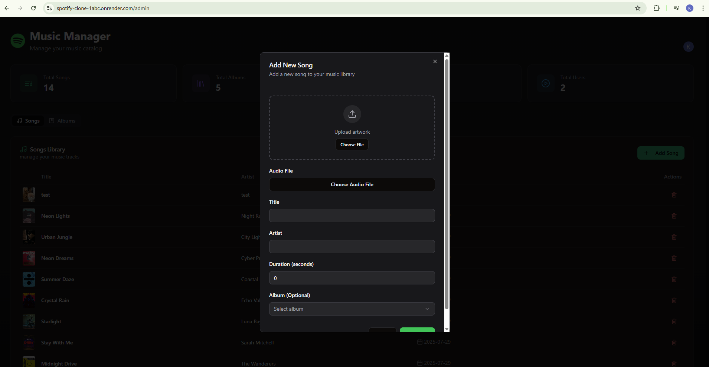

# 🎵 Spotify Clone (Real-Time)

A full-stack **Spotify-style music streaming app** with real-time chat, online member status, live listening activity, and an admin dashboard for complete control.  

🔗 **Live Demo:** (https://spotify-clone-1abc.onrender.com)  

---

## ⚡ Tech Stack

### 🖥️ Frontend
- ⚛️ React (with TypeScript)  
- 🎨 Tailwind CSS + shadcn/ui  
- 🗂️ Zustand (state management)  
- 💻 JavaScript  

### 🛠️ Backend
- 🟩 Node.js + Express.js  
- 🗄️ MongoDB (database)  
- 🔌 Socket.IO (real-time features)  
- 🌐 REST APIs & Authentication  

---

## 🚀 Features
- 🎶 Real-time Spotify-style music streaming  
- 💬 Real-time chat & messaging  
- 👥 Online member status & live listening activity  
- 🎛️ Admin dashboard for managing albums, songs, and users  
- 📱 Responsive modern UI with Tailwind + shadcn/ui  

---

## 📂 Deliverables
✔️ Fully functional music streaming app  
✔️ Secure backend with real-time WebSocket communication  
✔️ Scalable design & clean UI  
✔️ Admin tools for content and user management  

---

## 🚀 Deployment
🌍 Hosted on **Render**  
🔗 [Live Project](https://spotify-clone-1abc.onrender.com)  

---

## 📸 Screenshots
### 🏠 Home Page

### 📀 Add New Album (Admin Panel)

### ➕ Add New Song (Admin Panel)

